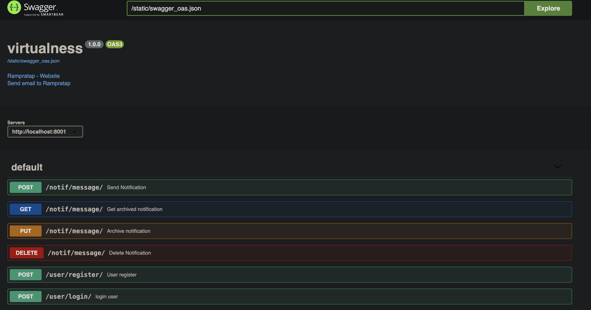

# Django Notification Center

Django Notification Center is a Python package that provides a flexible and extensible notification system for Django projects.

## Features

- Easily send notifications to users.
- Integration with Django's user authentication system.
- Simple API for sending and managing notifications.

## Setup
 Create virtual env
```shell
python3 -m venv <myenvname>
source <myenvname>/bin/activate
```
Install dependencies

```shell
    pip install requirements.txt
```
make and deploy migrations

```shell
python manage.py makemigrations
python manage.py migrate  
```

## Run Server

```shell
python manage.py runserver
```

## Run Test cases

```shell
python manage.py test 
```

# Check APIs

## swagger APIs

    Go to <host>:<port> on your browser after running server, where host and port are where this app server running.
    You will find all apis in swagger format
    It will look like this:


## Postman collection
    Postman collaction added in repo with here: 
### [Postman](virtualness.postman_collection.json)

## Http agent
A .http file is added at : 
[Apis](Apis.http) This can be run using http agent(vscode/pycharm extension)


# Flow of apis
## User register
- You have to register with username, email and password
- It will create user and return token or give error(might be duplication username/email)
- user token have to be used in all other apis

## User login
- User login can be done via username and password(which was created in register api)
- it will give user token or give some error in wrong pass or not exist user
- user token have to be used in all other apis

User token will be used in auth header as :
```
Authorization: Token <user token>
```
Include this header in all notification


## Send Notification
- This api will send notification to user (connect notification service at [signals](Notifications%2Fsignals.py#line23) line 23)
- It required receiver_id, notification_type, context of notification, message_content, description

## Get notification
- This api will give all unarchived and undeleted notifications of authenticated user

## Get archived notification
- This api will give all archived notifications of authenticated user

## Archive Notification
- This api will archive a notification with id of authenticated user

## Delete Notification
- This api will soft delete a notification with id of authenticated user


# For more info Contact

For any questions or inquiries, please feel free to reach out to us:
- **Name:** Ram Pratap

- **Email:** [Email](rampratap305@gmail.com)
- **Phone:** [7888924374](7888924374)


